  

 

---

Hi, I'm **Youcef Si-Ramdane**, a **third-year computer science student** at **Champlain College**. I build full-stack apps, work with microservices and DevOps

[linkedIn](https://www.linkedin.com/in/youcefsir/)

---

**languages** 

  

**frameworks & platforms** 

  

**tools** 

OOP · REST APIs · testing · Scrum · UI/UX · cybersecurity · discrete math

---

<table>
  <tr>
    <td width="33%" valign="top">
      <h4>Localfill <a href="https://localfill.dev">localfill.dev</a></h4>
      
<em>Open-source automated trading tool for Tradovate.</em>

      
      
      
      
      
      
    </td>
    <td width="33%" valign="top">
      <h4>IsmaCuts Manager</h4>
      
<em>Client project: a management app with a focus on UI/UX and systems design.</em>

      
      
      
    </td>
    <td width="33%" valign="top">
      <h4>Champlain Pet Clinic</h4>
      
<em>Microservices management system built with Scrum.</em>

      
      
      
      
    </td>
  </tr>
</table>

---

